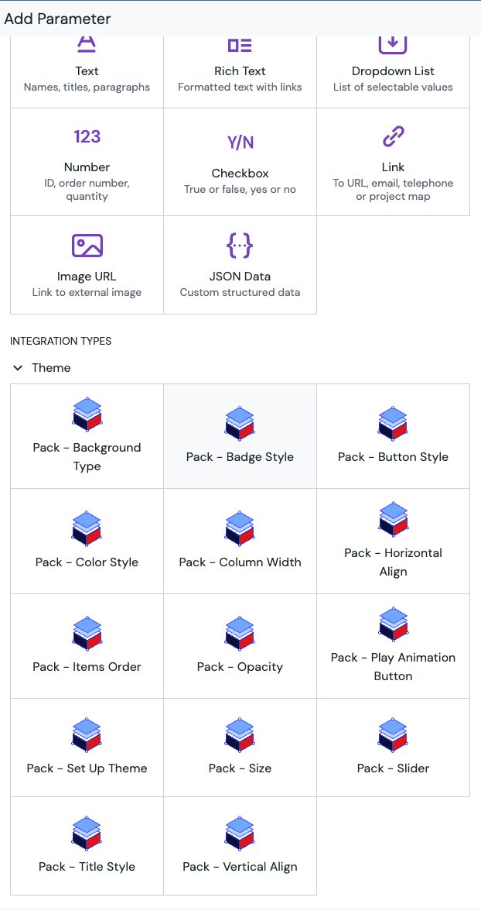

# Theme Pack Mesh app for Uniform

> ⚠️ This codebase doesn't support Node.js 21 or later yet, `npm run build` will break.

This mesh app extends Uniform Canvas UI with the support for themes and new custom parameters that facilitate the configuration of visual aspects - header style, button style, column size (slider), etc.

Underneath, it is a Next.js app instrumented with Mesh SDK, so it should provide familiar developer experience and deployment workflows.

This mesh app is built specifically for [Uniform Component Starter Kit (CSK)](https://components.uniform.app/) and works well with it, but it can be used with any front-end app. We recommend you having a [copy of Component Starter Kit (CSK)](https://github.com/uniformdev/uniform-component-starter-kit) to use as a reference.

## Step 1: creating your own custom mesh app

Grab JSON from [mesh-manifest.json](./mesh-manifest.json) and paste it as a new custom integration in your team settings. Notice `baseLocationUrl` is referencing localhost:3000 here. This means that if you are planning on deploying your own version of this mesh app, you will need to either update the manifest with a different url, or create a new instance of mesh app pointing to your production url.

After the custom integration is added to your team, you can add it to any of your projects.

## Step 2: Running mesh app locally

1. Run `npm install`
2. Run `npm run dev`

If the custom Theme Pack integration is added to your project, you should be able to set themes and add new Canvas parameters from the new types.

## Step 3: Deploying your mesh app

Since it's Next.js app, it can deploy anywhere you can deploy Next.js app to.
`npm run build` builds the production version, static version of the app. Consult your front-end cloud of choice on how to deploy Next.js app.

After you deploy the production version, make sure to update the mesh app manifest with new url.
